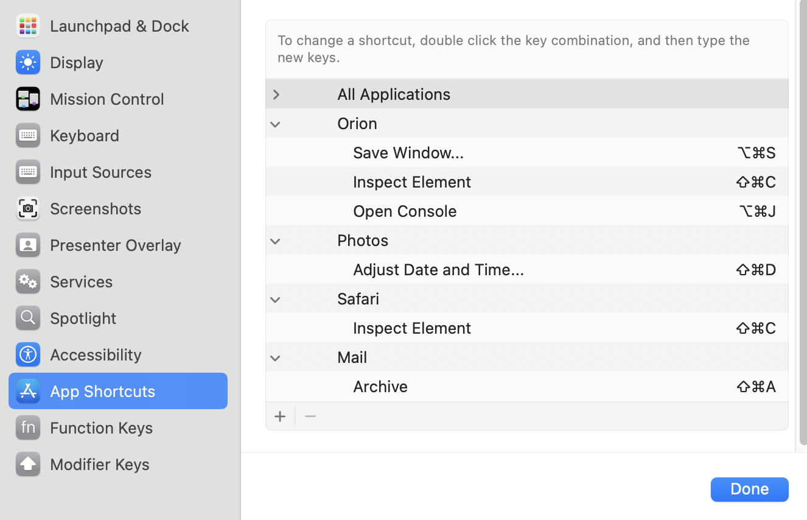

# App Configuration

## Finder

### General Preferences

* Open Preferences
* In General pane, choose items to show on Desktop and change "New Finder windows show" to your preference
* In Sidebar pane, choose items to show in sidebar. Go to home directory and drag any additional folders as desired
* In Advanced pane, if you want, check the boxes for _Keep folders on top_

### Make ~/Library visible in Finder

* Go to home folder
* Press <kbd>⌘j</kbd>
* Check "Show Library folder"

## Messages

* Open Preferences > iMessage
* Check "Enable Messages in iCloud"
* **On iPhone**, open Settings > Messages > Text Message Forwarding. Then turn on slider for your computer

## Keyboard shortcuts

* Open System Settings > Keyboard and click the Keyboard Shortcuts button and then App Shortcuts. Recommended settings:

<figure>
  
  <figcaption>Note: Orion's <code>Save Window...</code> shortcut is there to override its default <kbd>⇧⌘S</kbd> because my Chrome extension uses that for saving bookmarks.</figcaption>
</figure>

### Photos

* Adjust Date and Time... <kbd>⇧⌘D</kbd>

### Mail

* Archive <kbd>⇧⌘A</kbd>

### Safari

* Inspect Element <kbd>⇧⌘C</kbd>

### Orion:

* Inspect Element <kbd>⇧⌘C</kbd>
* Open Console <kbd>⌥⌘J</kbd>
